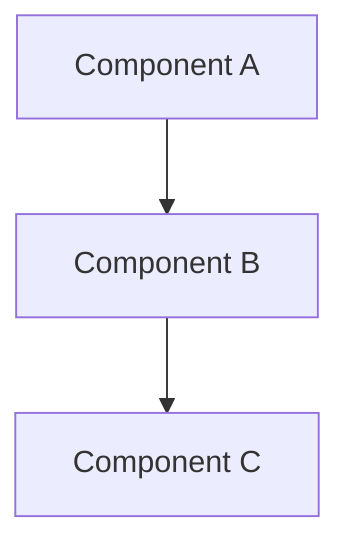
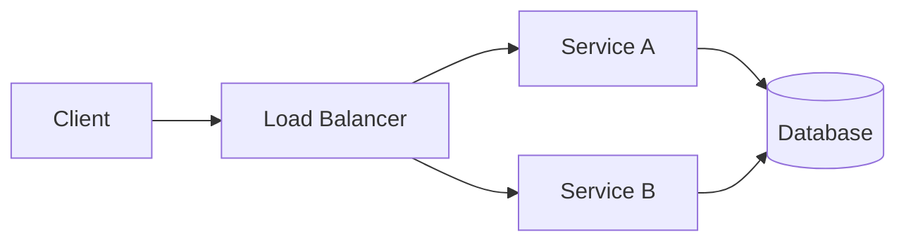

# Design Document Templates

Use these templates when generating design artifacts. They ensure consistency, completeness, and traceability.

## Feasibility Study Template

```markdown
# Feasibility Study: [Title]

## 1. Executive Summary
[Brief overview of the proposed solution and its feasibility assessment]

## 2. Problem Statement
[What problem are we solving and why does it matter?]

## 3. Proposed Solution
[High-level description of the approach]

### 3.1 Architecture Overview
[Block diagram or component overview]

### 3.2 Key Components
- **[Component A]** — [Purpose]
- **[Component B]** — [Purpose]

## 4. Technical Feasibility
[What's achievable with current technology and constraints]

### 4.1 Strengths
- [Strength 1]
- [Strength 2]

### 4.2 Challenges
- [Challenge 1] — [Mitigation]
- [Challenge 2] — [Mitigation]

### 4.3 Dependencies
- [External dependency 1]
- [External dependency 2]

## 5. Risk Assessment
| Risk | Likelihood | Impact | Mitigation |
|---|---|---|---|
| [Risk 1] | High/Med/Low | High/Med/Low | [Mitigation] |

## 6. Effort Estimation
| Phase | Effort | Dependencies | Timeline |
|---|---|---|---|
| Phase 1 | [Estimate] | [None/Dep] | [Timeline] |

## 7. Recommendations
- [Go/No-Go recommendation]
- [Alternative approaches considered]
- [Next steps]

## 8. References
- [URL 1]
- [URL 2]
```

## Design Document Template

```markdown
# Design Document: [Title]

## 1. Context
[What is being designed and why]

## 2. Requirements
- [Key requirements sourced from requirements engineering]
- [Trace to REQ-XXX identifiers]

## 3. Design Decisions
| Decision | Options Considered | Chosen | Rationale |
|---|---|---|---|
| [Decision 1] | [A, B, C] | [B] | [Why B] |

## 4. System Architecture
[Block diagram, component diagram, or architecture description]

### 4.1 Component Breakdown
- **[Component A]**
  - Responsibility: [What it does]
  - Interfaces: [APIs, messages, events]
  - Dependencies: [What it depends on]

### 4.2 Data Flow
[How data moves through the system]

### 4.3 Component Diagram


## 5. Interface Specifications
| Interface | Type | Description |
|---|---|---|
| [API/Event] | [REST/gRPC/Event] | [Description] |

## 6. Non-Functional Requirements
| Requirement | Target | Verification |
|---|---|---|
| Performance | [e.g., <100ms latency] | [Load test] |
| Reliability | [e.g., 99.9% uptime] | [Monitoring] |

## 7. Risks & Trade-offs
[Risks, trade-offs, open questions]

## 8. Implementation Plan
[Phased approach with milestones]

## 9. References
[Related documents, standards, research]
```

## Architecture Report Template

```markdown
# Architecture Report: [Title]

## 1. Architecture Overview
[High-level view of the system architecture]

## 2. Architectural Patterns
[Patterns used: microservices, event-driven, CQRS, etc.]

### 2.1 Pattern Justification
[Why each pattern was chosen]

## 3. Structural Decomposition
[How the system is decomposed into layers/modules/services]

### 3.1 Layer Architecture
```
┌─────────────────────┐
│   Presentation      │
├─────────────────────┤
│   Application       │
├─────────────────────┤
│   Domain            │
├─────────────────────┤
│   Infrastructure    │
└─────────────────────┘
```

## 4. Technology Selection
| Technology | Purpose | Rationale |
|---|---|---|
| [Tech 1] | [What it does] | [Why chosen] |

## 5. Deployment Architecture
[Deployment topology, infrastructure, CI/CD]

### 5.1 Deployment Diagram


## 6. Cross-Cutting Concerns
| Concern | Approach |
|---|---|
| Security | [Auth, encryption, etc.] |
| Observability | [Logging, metrics, tracing] |
| Reliability | [Retry, circuit breaker, etc.] |
| Scalability | [Horizontal/vertical scaling] |

## 7. Architectural Trade-offs
[Explicit trade-offs documented]

## 8. References
[Architecture frameworks, standards, references]
```

## Usage Guidelines

1. **Always start with context** — What problem are we solving?
2. **Trace requirements** — Link design decisions to requirements (REQ-XXX)
3. **Document trade-offs** — Why was option A chosen over option B?
4. **Include diagrams** — Use Mermaid, PlantUML, or ASCII for visual clarity
5. **Be specific** — Avoid vague statements; use measurable targets
6. **Keep it alive** — Update documents as the design evolves
