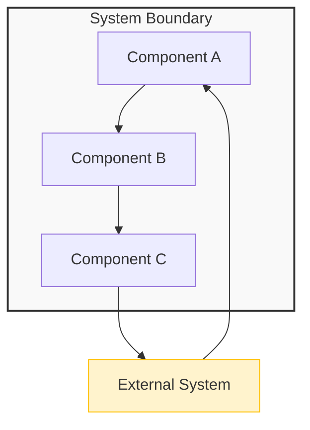
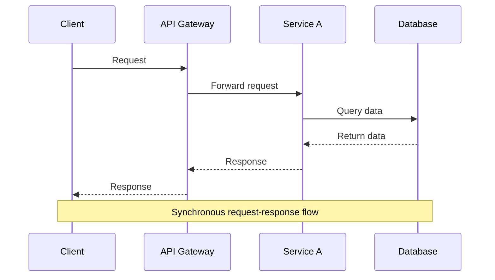
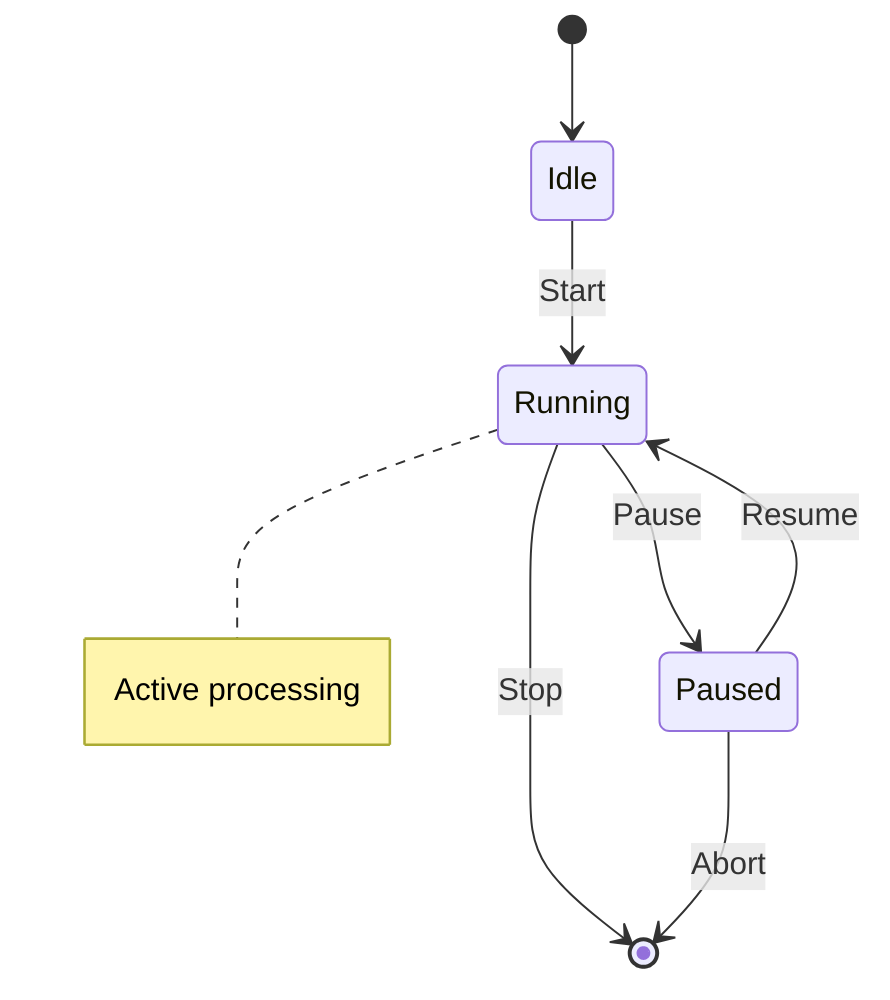
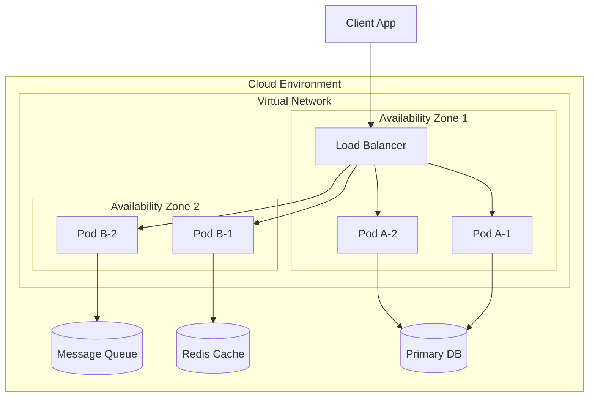
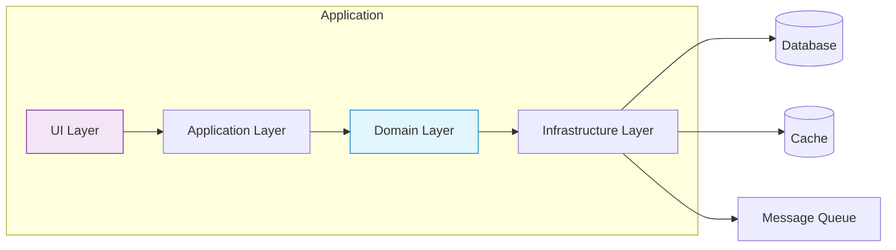
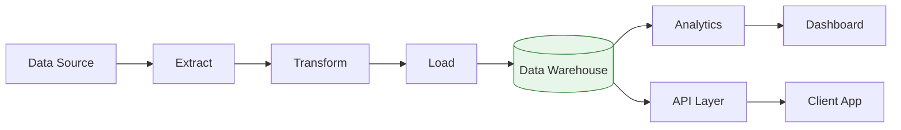
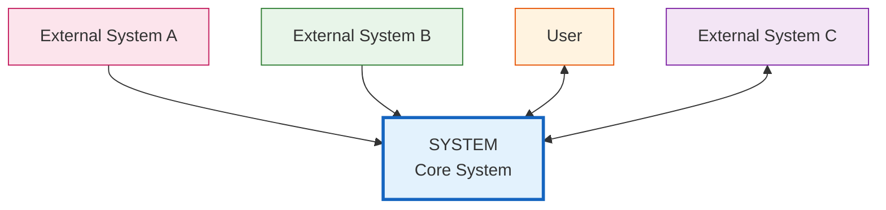
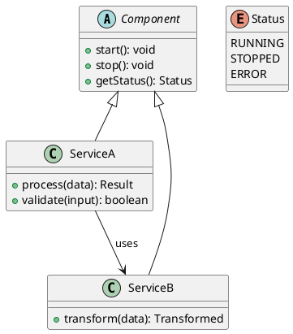
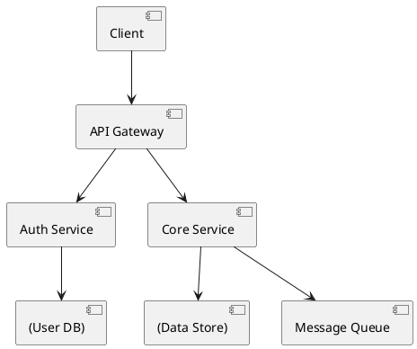
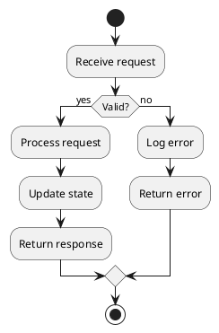

# Diagram Styles and Conventions

Use these conventions when creating diagrams for design documents. Consistent styling improves readability and maintainability.

## Mermaid Diagrams

Mermaid is the preferred diagram format for most design artifacts.

### Block Diagram

Use for system components and their relationships.



### Sequence Diagram

Use for interaction flows between components or services.



### State Diagram

Use for component states and transitions.



### Deployment Diagram

Use for infrastructure and deployment topology.



### Component Diagram

Use for internal component structure and dependencies.



### Data Flow Diagram

Use for showing how data moves through the system.



### Context Diagram

Use for system boundaries and external entities.



## Mermaid Styling Conventions

| Element | Style | Use |
|---|---|---|
| `subgraph` | `fill:#f9f9f9,stroke:#333` | Group related components |
| `style` | `fill:#e3f2fd,stroke:#1565c0` | System boundary (blue) |
| `style` | `fill:#fff3e0,stroke:#e65100` | User/actor (orange) |
| `style` | `fill:#e8f5e9,stroke:#2e7d32` | Infrastructure (green) |
| `style` | `fill:#fce4ec,stroke:#c2185b` | External system (pink) |
| `style` | `fill:#e1f5fe,stroke:#0288d1` | Domain/business logic (light blue) |
| `Note` | `Note over A,B` | Cross-component notes |

## PlantUML Diagrams

Use PlantUML for UML-specific diagrams (class, component, activity).

### Class Diagram



### Component Diagram



### Activity Diagram



## ASCII Diagrams

Use ASCII for simple layouts, quick sketches, or when Mermaid/PlantUML rendering is not available.

### Component Layout

```
┌─────────────────────────────────────────────────┐
│                   System Boundary                │
│                                                 │
│  ┌──────────┐    ┌──────────┐    ┌──────────┐  │
│  │  Client   │───▶│  API GW  │───▶│  Service  │  │
│  │  Layer    │    │          │    │  Layer   │  │
│  └──────────┘    └──────────┘    └─────┬────┘  │
│                                        │       │
│  ┌──────────┐    ┌──────────┐    ┌─────▼────┐  │
│  │  Cache   │◀───│  Queue   │◀───│  Domain   │  │
│  │  Layer   │    │  Layer   │    │  Layer   │  │
│  └──────────┘    └──────────┘    └──────────┘  │
│                                                 │
└─────────────────────────────────────────────────┘
```

### Data Flow

```
  ┌─────────┐     ┌─────────┐     ┌─────────┐
  │  Source  │────▶│ Process │────▶│  Sink   │
  │ (Reader)│     │ (Worker)│     │(Writer) │
  └─────────┘     └─────────┘     └─────────┘
       │                 │                │
       ▼                 ▼                ▼
  ┌─────────┐     ┌─────────┐     ┌─────────┐
  │  Queue  │     │   Log   │     │ Database│
  └─────────┘     └─────────┘     └─────────┘
```

### Deployment Topology

```
                    ┌──────────────┐
                    │   Client     │
                    │   (Browser)  │
                    └──────┬───────┘
                           │ HTTPS
                    ┌──────▼───────┐
                    │  Load Balancer│
                    └──────┬───────┘
                           │
              ┌────────────┼────────────┐
              │            │            │
      ┌───────▼───┐ ┌─────▼────┐ ┌─────▼────┐
      │  Server A  │ │ Server B │ │ Server C │
      │  (Primary) │ │ (Primary)│ │ (Primary)│
      └──────┬─────┘ └─────┬────┘ └─────┬────┘
             │             │             │
      ┌──────▼─────────────▼─────────────▼────┐
      │              Database Cluster          │
      │        (Primary + 2 Replicas)          │
      └────────────────────────────────────────┘
```

## Diagram Selection Guide

| Purpose | Best Format | Example |
|---|---|---|
| System overview | Block Diagram (Mermaid) | Components and relationships |
| Interaction flow | Sequence Diagram (Mermaid) | API calls, event sequences |
| State behavior | State Diagram (Mermaid) | Component lifecycle |
| Infrastructure | Deployment Diagram (Mermaid) | Servers, databases, networks |
| Internal structure | Component Diagram (Mermaid) | Layer architecture |
| Data movement | Data Flow Diagram (Mermaid) | ETL, pipelines |
| System boundaries | Context Diagram (Mermaid) | External entities |
| Class structure | Class Diagram (PlantUML) | OOP design |
| Process logic | Activity Diagram (PlantUML) | Decision flows |
| Quick sketch | ASCII | Simple layouts, rough drafts |

## Diagram Best Practices

1. **Keep it simple** — One diagram per concept; avoid overcrowding
2. **Use consistent styling** — Same colors for same element types across all diagrams
3. **Label everything** — Every node and edge should have a clear label
4. **Use subgraphs** — Group related components visually
5. **Add notes** — Use `Note` or `note` for clarifications
6. **Include a legend** — If using custom colors or symbols, explain them
7. **Version diagrams** — Reference diagram version in document metadata
8. **Keep diagrams close to text** — Place diagrams near their description
9. **Use ASCII fallback** — Provide ASCII version if Mermaid/PlantUML may not render
10. **Review for clarity** — Ask someone unfamiliar with the system to read the diagram
