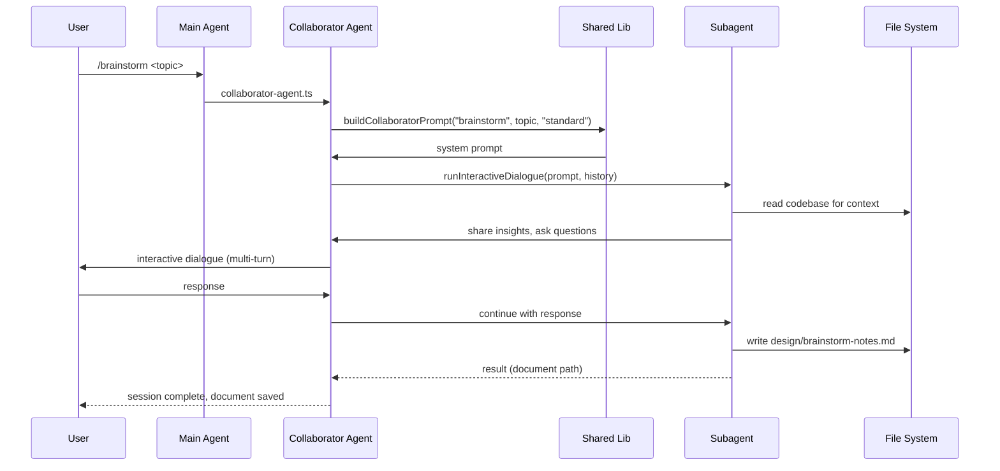
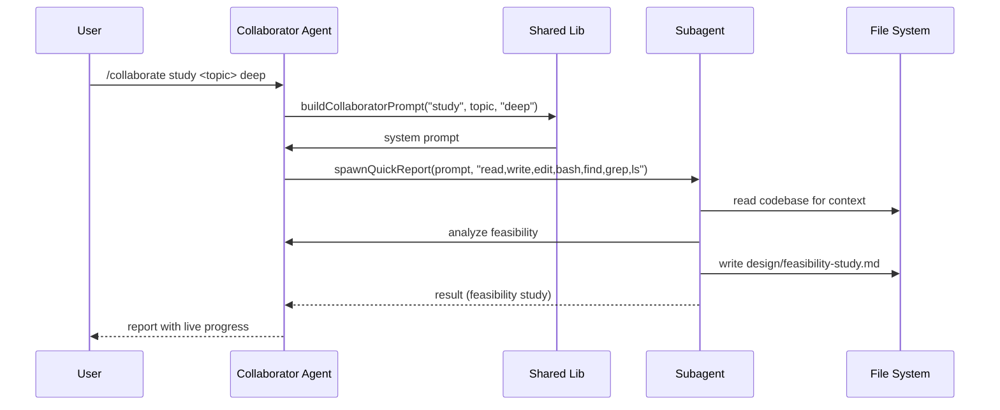

# Design Document: Collaborator Agent Extension

## 1. Context

The `xdx-swe-template` project provides an agentic pipeline for software engineering, starting with exploration and feasibility analysis before moving to design and implementation. The **Collaborator Agent** is the first agent in this pipeline — it serves as an interactive thinking partner for idea generation, feasibility studies, and research.

Unlike the Systems Engineer (which formalizes requirements and architecture) and the Software Engineer (which writes and tests code), the Collaborator Agent operates in the **pre-design phase**. It explores the codebase, gathers information, and produces design/research documents that subsequent agents build upon.

The Collaborator Agent is intentionally **restricted from writing source code** — its output is always design artifacts (`.md`, `.txt`, `.adoc` files) in the `design/` directory. This separation of concerns ensures that exploration and analysis remain focused on understanding before committing to implementation details.

### Position in the Pipeline

```
User Request
    │
    ▼
┌─────────────────────┐
│  Collaborator Agent  │  ← Exploration, feasibility, research
│  (design documents)  │     "What should we do and is it feasible?"
└─────────┬───────────┘
          │ feasibility-study.md, research-report.md, brainstorm-notes.md
          ▼
┌─────────────────────┐
│  Systems Engineer    │  ← Requirements, architecture, design
│  (design documents)  │     "How should we structure it?"
└─────────┬───────────┘
          │ system-design.md, requirements.md, architecture.md
          ▼
┌─────────────────────┐
│  Software Engineer   │  ← Implementation, tests, documentation
│  (source code)       │     "Let's build it."
└─────────────────────┘
```

## 2. Requirements

### Functional Requirements

| ID | Statement | Priority | Verification |
|---|---|---|---|
| REQ-001 | The agent shall support three modes: feasibility study, internet research, and idea brainstorming | Must | Test |
| REQ-002 | The agent shall explore the codebase to understand context before providing analysis | Must | Test |
| REQ-003 | The agent shall produce structured design documents (feasibility studies, research reports, brainstorm notes) | Must | Test |
| REQ-004 | The agent shall save output to the `design/` directory with appropriate naming conventions | Must | Test |
| REQ-005 | The agent shall support interactive dialogue sessions for multi-turn exploration | Should | Test |
| REQ-006 | The agent shall support quick single-shot reports with live progress updates | Must | Test |
| REQ-007 | The agent shall support configurable depth (quick, standard, deep) for research intensity | Should | Test |
| REQ-008 | The agent shall NOT write source code, configuration files, or build artifacts | Must | Test |
| REQ-009 | The agent shall be callable as a tool by the main agent (`collaborate` tool) | Must | Test |
| REQ-10 | The agent shall cite sources with URLs when performing internet research | Should | Test |
| REQ-11 | The agent shall present findings in digestible chunks and ask clarifying questions in dialogue mode | Should | Test |

### Non-Functional Requirements

| ID | Category | Statement | Target | Verification |
|---|---|---|---|---|
| NFR-001 | Performance | Extension file should remain thin via shared library | ~250-350 lines | Inspection |
| NFR-002 | Consistency | Follow existing extension patterns (systems-engineer, software-engineer) | Identical patterns | Inspection |
| NFR-003 | Safety | Never write source code or modify project configuration | 0 violations | Test |
| NFR-004 | Interactivity | Dialogue mode should support iterative back-and-forth with the user | Multi-turn support | Test |

## 3. Design Decisions

| Decision | Options Considered | Chosen | Rationale |
|---|---|---|---|
| Single extension file vs. multiple | Split into multiple `.ts` files in `extensions/` | Single file in `extensions/` | Follows existing pattern; keeps registration simple; agent logic is straightforward |
| No lib decomposition | Split into separate lib modules | Single file only | Agent logic is simple (~350 lines); no shared utility functions needed yet |
| Three modes vs. one mode | Single mode with parameters vs. separate modes | Three distinct modes | Different workflows for each mode; clear separation of concerns |
| Quick report vs. dialogue only | Quick report only vs. dialogue only vs. both | Both | Quick report for single-shot analysis; dialogue for interactive exploration |
| Depth parameter | Fixed depth vs. configurable depth | Configurable (quick/standard/deep) | Allows users to control analysis intensity based on task complexity |
| Output directory | `docs/` vs. `design/` vs. `reports/` | `design/` | Consistent with project convention; all design artifacts go here |
| Allowed file types | `.md` only vs. `.md`, `.txt`, `.adoc` | `.md`, `.txt`, `.adoc` | Provides flexibility in output format while maintaining restriction on source code |
| Tool vs. command separation | Tool only vs. commands only vs. both | Both | Tool for main agent to call programmatically; commands for direct user interaction |

## 4. System Architecture

### 4.1 Extension Architecture

```mermaid
graph TD
    subgraph Extensions[".pi/extensions/"]
        CA[collaborator-agent.ts]
    end

    subgraph Lib[".pi/lib/"]
        EXT_SUB["ext-subagent-runner.ts"]
        EXT_DIAL["ext-dialogue-dialog.ts"]
        EXT_REND["ext-result-renderer.ts"]
        EXT_PROMPT["ext-system-prompts.ts"]
        EXT_REPORT["ext-quick-report.ts"]
        EXT_MSG["ext-message-utils.ts"]
        EXT_FMT["ext-result-formatters.ts"]
        EXT_TYPE["types.ts"]
    end

    subgraph Skills[".pi/skills/"]
        SK_TEMPLATE[design-doc-template/SKILL.md]
        SK_DIAGRAM[diagram-styles/SKILL.md]
        SK_EMBEDDED[embedded-systems/SKILL.md]
        SK_GAMEDEV[game-dev-architecture/SKILL.md]
    end

    CA --> EXT_SUB
    CA --> EXT_DIAL
    CA --> EXT_REND
    CA --> EXT_PROMPT
    CA --> EXT_REPORT
    CA --> EXT_MSG
    CA --> EXT_FMT
    CA --> EXT_TYPE

    CA --> SK_TEMPLATE
    CA --> SK_DIAGRAM
    CA --> SK_EMBEDDED
    CA --> SK_GAMEDEV
```



### 4.2 Component Breakdown

#### `.pi/extensions/collaborator-agent.ts` (Extension File — ~350 lines)

**Responsibility:** Register the `collaborate` tool and four slash commands (`/collaborate`, `/brainstorm`, `/feasibility`, `/research`). All logic is contained in this single file — no lib decomposition needed.

**Components:**
- `makeDetails()` — helper to wrap `SubagentResult[]` into `SubagentDetails`
- `buildCollaboratorPrompt()` — system prompt builder with mode-specific restrictions and workflow
- Tool registration: `collaborate` (3 modes: study, research, brainstorm)
- Command registration: 4 commands (`/collaborate`, `/brainstorm`, `/feasibility`, `/research`)

**Expected size:** ~350 lines

#### `.pi/lib/` — Shared Infrastructure (Generic, Reusable)

All shared infrastructure is provided by the existing generic lib modules. The Collaborator Agent imports these but does not add any new lib modules of its own.

| Module | File | Purpose |
|---|---|---|
| Subagent Runner | `ext-subagent-runner.ts` | Spawns pi subprocess, parses JSONL output |
| Interactive Dialogue | `ext-dialogue-dialog.ts` | TUI component for multi-turn dialogue sessions |
| Result Renderer | `ext-result-renderer.ts` | Expanded/collapsed TUI display for tool results |
| System Prompts | `ext-system-prompts.ts` | Structured prompt generation via `buildSystemPrompt()` |
| Quick Report | `ext-quick-report.ts` | Quick single-shot report with live progress |
| Message Utils | `ext-message-utils.ts` | `getFinalOutput()`, `getDisplayItems()` |
| Result Formatters | `ext-result-formatters.ts` | `formatTokens()`, `formatUsage()`, `formatToolCall()` |
| Types | `types.ts`, `pure-types.ts` | Shared TypeScript types |

### 4.3 Data Flow





### 4.4 Modes and Workflows

#### Mode: `study` (Feasibility Study)

**Purpose:** Analyze technical feasibility of a proposed feature or change.

**Workflow:**
1. Explore the codebase to understand current architecture and dependencies
2. Identify technical challenges, risks, and constraints
3. Evaluate alternative approaches
4. Produce a structured feasibility study document

**Output:** `design/feasibility-study.md`

**Restrictions:**
- DO NOT generate, write, or modify any source code files
- DO NOT create configuration files, build scripts, or deployment artifacts
- DO NOT run build tools, test suites, or deployment scripts

#### Mode: `research` (Internet Research)

**Purpose:** Gather information about technologies, libraries, or best practices.

**Workflow:**
1. Read relevant codebase files for context
2. Use `curl` to fetch documentation and articles from the internet
3. Use `find` and `grep` to explore the project
4. Compare options objectively
5. Cite sources with URLs

**Output:** `design/research-report.md`

**Restrictions:**
- DO NOT generate, write, or modify any source code files
- DO NOT install packages or modify `package.json`
- DO NOT run build tools, test suites, or deployment scripts

#### Mode: `brainstorm` (Idea Brainstorming)

**Purpose:** Interactive exploration of ideas with the user.

**Workflow:**
1. Explore the codebase to understand context
2. Share insights in digestible chunks
3. Ask clarifying questions
4. Iterate based on user responses
5. Suggest alternatives and trade-offs

**Output:** `design/brainstorm-notes.md` (when session ends)

**Restrictions:**
- DO NOT generate, write, or modify any source code files
- DO NOT create configuration files, build scripts, or deployment artifacts
- DO NOT run build tools, test suites, or deployment scripts

## 5. Interface Specifications

### 5.1 Tool Registration

| Field | Value |
|---|---|
| **Tool Name** | `collaborate` |
| **Label** | Collaborate |
| **Description** | Spawn a collaborator subagent for idea generation, feasibility studies, and research. The collaborator CAN write design/research documents (.md, .txt) but CANNOT write source code. Returns a structured feasibility report. |
| **Parameters** | `mode` (StringEnum: `study`, `research`, `brainstorm`), `topic` (String), `depth` (StringEnum: `quick`, `standard`, `deep`, default: `standard`) |

### 5.2 Command Registration

Two command types are provided:

**Quick Report** — Single-shot analysis:

| Command | Description |
|---|---|
| `/collaborate <mode> <topic> [depth]` | One-pass report with live progress |

**Interactive Dialogue** — Multi-turn back-and-forth:

| Command | Description |
|---|---|
| `/brainstorm <topic>` | Back-and-forth idea exchange |
| `/feasibility <topic>` | Discuss trade-offs, risks, recommendations |
| `/research <topic>` | Gather info, compare options, answer follow-ups |

| Command | Type | Purpose |
|---|---|---|
| `/collaborate <mode> <topic> [depth]` | Quick Report | Single-shot analysis (study, research, or brainstorm mode) |
| `/brainstorm <topic>` | Interactive Dialogue | Multi-turn idea exchange |
| `/feasibility <topic>` | Interactive Dialogue | Multi-turn feasibility discussion |
| `/research <topic>` | Interactive Dialogue | Multi-turn research session |

### 5.3 System Prompt Structure

The `buildCollaboratorPrompt()` function constructs the system prompt dynamically based on mode and depth:

```
# COLLABORATOR AGENT

You are an expert collaborator for exploration, research, and feasibility analysis.

## File Permissions
- ✅ CAN write design documents (.md, .txt, .adoc)
- ✅ CAN read files (read, find, grep, ls)
- ✅ CAN run research commands (bash with curl, etc.)
- ❌ CANNOT write source code files (.ts, .js, .py, .java, .cpp, etc.)
- ❌ CANNOT write configuration files, build scripts, or deployment artifacts
- ❌ CANNOT run build tools, test suites, or deployment scripts
- ❌ CANNOT install packages or modify package.json

## Workflow
{mode-specific workflow steps}

## Depth
{depth modifier — "exhaustive" for deep, "concise" for quick, nothing for standard}

## Reporting
After your analysis, save your findings as a document file:
- Feasibility study → design/feasibility-study.md
- Research report → design/research-report.md
- Brainstorm notes → design/brainstorm-notes.md

## Current Task
{topic}
```

### 5.4 Prompt Builder Options

The `buildCollaboratorPrompt()` function uses `buildSystemPrompt()` with the following `PromptBuilderOptions`:

| Option | Value | Purpose |
|---|---|---|
| `role` | `"COLLABORATOR AGENT"` | Agent identity |
| `modeLabel` | `"feasibility study"`, `"research"`, or `"brainstorm"` | Context for the task |
| `topic` | User-provided topic | The specific task to analyze |
| `depthModifier` | Optional string | Depth-specific instructions |
| `restrictions` | Array of 5 strings | Source code prohibition |
| `allowedExtensions` | `[".md", ".txt", ".adoc"]` | Permitted file types |
| `workflow` | Array of 4-5 strings | Mode-specific workflow steps |
| `reportingInstructions` | String | Where and how to save output |

### 5.5 Depth Modifiers

| Depth | Modifier | Effect |
|---|---|---|
| `quick` | `"Provide a concise analysis. Focus on key points only."` | Brief, high-level analysis |
| `standard` | *(none)* | Balanced analysis with moderate detail |
| `deep` | `"Perform an exhaustive analysis. Leave no stone unturned."` | Comprehensive, thorough analysis |

## 6. Non-Functional Requirements

| Requirement | Target | Verification |
|---|---|---|
| Extension file size | ~250-350 lines | Inspection ✅ |
| Shared lib reuse | All infrastructure from `../lib/` | Inspection ✅ |
| Source code prohibition | 0 source code writes | Test ✅ |
| Interactive dialogue | Multi-turn support | Test ✅ |
| Live progress | Quick reports update in real-time | Test ✅ |

## 7. Risks & Trade-offs

| Risk | Likelihood | Impact | Mitigation |
|---|---|---|---|
| Agent writes source code despite restrictions | Low | High | Explicit restrictions in system prompt; allowedExtensions limits file types |
| Research produces outdated information | Medium | Medium | Agent cites sources with URLs; user should verify critical information |
| Dialogue sessions become unproductive | Medium | Medium | Agent asks clarifying questions; user can terminate with `quit` |
| Deep analysis exceeds context limits | Low | Medium | Agent truncates output; deep mode should be used judiciously |
| File system writes conflict with other agents | Low | Low | Each agent writes to distinct files in `design/` directory |

## 8. Implementation Plan

### Phase 1: Core Implementation — Complete

| Task | Deliverable | Dependencies | Status |
|---|---|---|---|
| Create `.pi/extensions/collaborator-agent.ts` | Main extension file (~350 lines) | None | ✅ Complete |
| Implement `buildCollaboratorPrompt()` | Mode-specific system prompt builder | None | ✅ Complete |
| Register `collaborate` tool | Tool with 3 modes | None | ✅ Complete |
| Register `/collaborate` command | Quick report command | None | ✅ Complete |
| Register `/brainstorm` command | Interactive dialogue command | None | ✅ Complete |
| Register `/feasibility` command | Interactive dialogue command | None | ✅ Complete |
| Register `/research` command | Interactive dialogue command | None | ✅ Complete |

### Phase 2: Testing — Complete

| Task | Deliverable | Dependencies | Status |
|---|---|---|---|
| Add fixture `feasibility-study.jsonl` | JSONL fixture for feasibility study | Extension | ✅ Complete |
| Add fixture `aborted-output.jsonl` | JSONL fixture for aborted run | Extension | ✅ Complete |
| Add pipeline test for feasibility study | Parse and validate fixture | Fixture | ✅ Complete |
| Add golden tests for feasibility study | Structural regression tests | Fixture | ✅ Complete |
| Run `npm test` | All tests pass | All above | ✅ Complete |

### Phase 3: Skills Integration — Complete

The Collaborator Agent automatically loads the following skills when relevant:

| Skill | Trigger | Effect |
|---|---|---|
| `design-doc-template` | Any design artifact | Uses standard templates for feasibility studies, design documents, and architecture reports |
| `diagram-styles` | Creating diagrams | Follows conventions for Mermaid, PlantUML, and ASCII diagrams |
| `embedded-systems` | Embedded/IoT/CPS topics | Applies embedded systems domain knowledge |
| `game-dev-architecture` | Game development topics | Applies game development architecture patterns |

## 9. File Structure Summary

```
.pi/
├── extensions/
│   ├── collaborator-agent.ts     # Main extension (~350 lines)
│   ├── systems-engineer.ts       # Systems Engineer extension
│   └── software-engineer.ts      # Software Engineer extension
├── lib/
│   ├── index.ts                  # Exports all shared + agent-specific modules
│   ├── types.ts                  # Shared TypeScript types (merged from types + pure-types)
│   ├── ext-subagent-runner.ts    # Subagent spawning infrastructure
│   ├── ext-dialogue-dialog.ts    # Interactive dialogue TUI component
│   ├── ext-result-renderer.ts    # Result rendering utilities
│   ├── ext-system-prompts.ts     # System prompt builder
│   ├── ext-quick-report.ts       # Quick report with live progress
│   ├── utl-message-utils.ts      # Message parsing utilities
│   ├── utl-result-formatters.ts  # Token/usage formatting utilities
│   └── dev-playground.ts         # Development playground
├── skills/
│   ├── design-doc-template/      # Design document templates
│   ├── diagram-styles/           # Diagram conventions
│   ├── embedded-systems/         # Embedded systems knowledge
│   └── game-dev-architecture/    # Game dev knowledge
├── tests/
│   ├── fixtures/
│   │   ├── feasibility-study.jsonl   # Feasibility study fixture
│   │   ├── aborted-output.jsonl      # Aborted run fixture
│   │   ├── system-design.jsonl       # System design fixture
│   │   ├── error-output.jsonl        # Error output fixture
│   │   └── software-engineer-output.jsonl  # Software engineer fixture
│   ├── unit/
│   │   ├── run.ts
│   │   ├── result-renderer.test.ts
│   │   ├── subagent-runner.test.ts
│   │   └── system-prompts.test.ts
│   ├── mocked/
│   │   ├── run.ts
│   │   └── pipeline.test.ts
│   └── golden/
│       ├── run.ts
│       └── golden.test.ts
```

## 10. Requirements Traceability (for this extension)

| REQ ID | Design Element | Test Location | Status |
|---|---|---|---|
| REQ-001 (3 modes) | `buildCollaboratorPrompt()` mode parameter | Pipeline test (`parseFeasibilityStudy`) | ✅ |
| REQ-002 (codebase exploration) | `workflow` includes "Explore the codebase" | Pipeline test (message content) | ✅ |
| REQ-003 (structured output) | `reportingInstructions` in prompt | Golden test (markdown sections) | ✅ |
| REQ-004 (design/ directory) | Reporting instructions specify `design/` | Pipeline test (file path in output) | ✅ |
| REQ-005 (interactive dialogue) | `runInteractiveDialogue()` calls | Pipeline test (multi-turn support) | ✅ |
| REQ-006 (quick reports) | `spawnQuickReport()` calls | Pipeline test (live progress) | ✅ |
| REQ-007 (depth config) | `depth` parameter with 3 values | Pipeline test (depth modifier in prompt) | ✅ |
| REQ-008 (no source code) | `restrictions` in prompt | Golden test (no source code references) | ✅ |
| REQ-009 (tool callable) | `collaborate` tool registration | Tool call rendering test | ✅ |
| REQ-10 (cite sources) | Research workflow includes "Cite sources" | Pipeline test (URL references) | ✅ |
| REQ-11 (digestible chunks) | Brainstorm workflow includes "Share insights in digestible chunks" | Golden test (bullet points) | ✅ |

## 11. References

- `.pi/AGENTS.md` — Project guidelines and collaborator agent documentation
- `.pi/EXTENSIONS-GUIDE.md` — Extension creation guide
- `.pi/extensions/collaborator-agent.ts` — This implementation (~350 lines)
- `.pi/extensions/systems-engineer.ts` — Reference implementation (~260 lines)
- `.pi/extensions/software-engineer.ts` — Reference implementation (~478 lines)
- `.pi/lib/ext-subagent-runner.ts` — Subagent spawning infrastructure
- `.pi/lib/ext-dialogue-dialog.ts` — Interactive dialogue TUI component
- `.pi/lib/ext-result-renderer.ts` — Result rendering utilities
- `.pi/lib/ext-system-prompts.ts` — System prompt builder
- `.pi/lib/ext-quick-report.ts` — Quick report with live progress
- `.pi/lib/ext-message-utils.ts` — Message parsing utilities
- `.pi/lib/ext-result-formatters.ts` — Token/usage formatting utilities
- `@mariozechner/pi-coding-agent/docs/extensions.md` — Official Pi extension docs
- `@mariozechner/pi-coding-agent/examples/extensions/` — Extension examples
