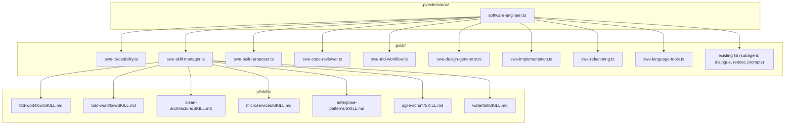
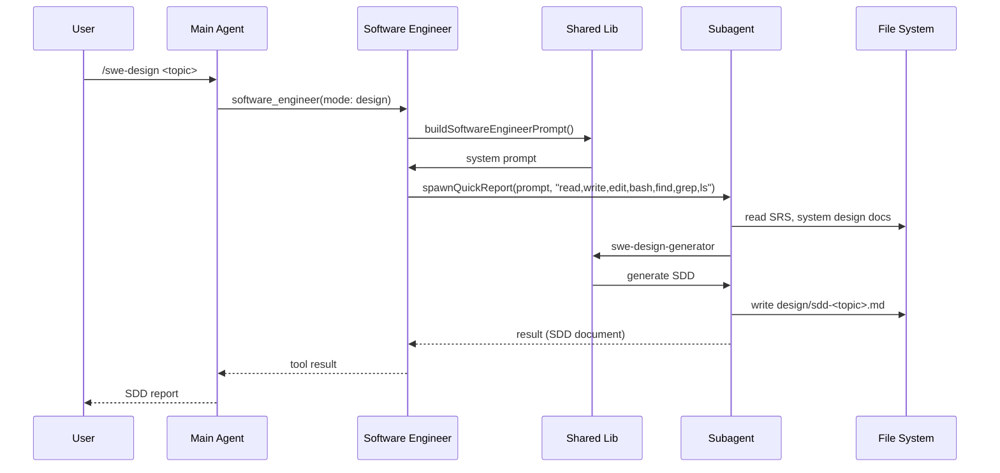

# Design Document: Software Engineer Agent Extension

## 1. Implementation Status

| Phase | Status | Deliverables | Notes |
|---|---|---|---|
| Phase 1: Core Infrastructure | ✅ Complete | 5 lib modules + 1 extension file | All modules implemented and tested |
| Phase 2: Advanced Features | ✅ Complete | 4 lib modules | Code reviewer, refactoring, build proposer, language tools |
| Phase 3: Skills | ⏸️ Pending | 7 skill SKILL.md files | Domain knowledge files — created as follow-up task |
| Phase 4: Testing | ✅ Complete | 9 unit tests + pipeline + golden tests | 232 tests, all passing |

### Phase 1: Core Infrastructure — Complete

| Module | File | Lines | Status |
|---|---|---|---|
| `swe-traceability.ts` | `.pi/lib/swe-traceability.ts` | 192 | ✅ Implemented |
| `swe-skill-manager.ts` | `.pi/lib/swe-skill-manager.ts` | 258 | ✅ Implemented |
| `swe-design-generator.ts` | `.pi/lib/swe-design-generator.ts` | 355 | ✅ Implemented |
| `swe-implementation.ts` | `.pi/lib/swe-implementation.ts` | 256 | ✅ Implemented |
| `swe-tdd-workflow.ts` | `.pi/lib/swe-tdd-workflow.ts` | 201 | ✅ Implemented |
| `software-engineer.ts` | `.pi/extensions/software-engineer.ts` | 478 | ✅ Implemented |

### Phase 2: Advanced Features — Complete

| Module | File | Lines | Status |
|---|---|---|---|
| `swe-code-reviewer.ts` | `.pi/lib/swe-code-reviewer.ts` | 259 | ✅ Implemented |
| `swe-refactoring.ts` | `.pi/lib/swe-refactoring.ts` | 232 | ✅ Implemented |
| `swe-build-proposer.ts` | `.pi/lib/swe-build-proposer.ts` | 229 | ✅ Implemented |
| `swe-language-tools.ts` | `.pi/lib/swe-language-tools.ts` | 487 | ✅ Implemented |

### Phase 4: Testing — Complete

| Test File | Lines | Tests | Status |
|---|---|---|---|
| `unit/swe-traceability.test.ts` | 142 | 12 | ✅ |
| `unit/swe-skill-manager.test.ts` | 97 | 11 | ✅ |
| `unit/swe-design-generator.test.ts` | 130 | 10 | ✅ |
| `unit/swe-implementation.test.ts` | 81 | 8 | ✅ |
| `unit/swe-tdd-workflow.test.ts` | 75 | 9 | ✅ |
| `unit/swe-code-reviewer.test.ts` | 111 | 9 | ✅ |
| `unit/swe-refactoring.test.ts` | 82 | 7 | ✅ |
| `unit/swe-build-proposer.test.ts` | 122 | 14 | ✅ |
| `unit/swe-language-tools.test.ts` | 120 | 12 | ✅ |
| `mocked/pipeline.test.ts` | 351 | 7 | ✅ |
| `golden/golden.test.ts` | 227 | 7 | ✅ |
| `fixtures/software-engineer-output.jsonl` | 1 | — | ✅ |

**Total test count: 232 tests (all passing)**

## 2. Context

The `xdx-swe-template` project currently provides two agent extensions:

- **Collaborator Agent** — exploration, research, and feasibility studies (design documents only, no source code)
- **Systems Engineer** — system design, requirements engineering, and architecture (design artifacts only, no source code)

There is a gap: **no agent extension can write, modify, or test source code**. The `software-engineer` extension fills this gap, bridging the systems engineer's output (SRS, system design) into implemented, tested source code.

This extension is the **implementation engine** of the SWE agentic pipeline:

```
Collaborator   → feasibility-research (design docs)
Systems Engineer → system-design-requirements (design docs)
Software Engineer → detailed-design-implementation-tests (source code)
```

## 2. Requirements

### Functional Requirements

| ID | Statement | Priority | Verification |
|---|---|---|---|
| REQ-001 | The agent shall read, write, edit, and analyze source code in any programming language | Must | Test |
| REQ-002 | The agent shall generate a Software Detailed Design (SDD) from the Systems Engineer's output (SRS + system design) | Must | Test |
| REQ-003 | The agent shall implement approved detailed designs into modular, well-structured, functional source code | Must | Test |
| REQ-004 | The agent shall generate complete test suites: component (unit), integration, and system (E2E) tests | Must | Test |
| REQ-005 | The agent shall maintain requirements traceability from SRS → SDD → source code ↔ tests | Must | Test |
| REQ-006 | The agent shall follow software engineering best practices (clean code, SOLID, DRY, design patterns) | Must | Test |
| REQ-007 | The agent shall adapt to different workflows/processes via skills (TDD, BDD, Agile, etc.) | Should | Test |
| REQ-008 | The agent shall propose build/config changes but require user approval before applying | Must | Test |
| REQ-009 | The agent shall support interactive dialogue sessions for review and refinement | Should | Test |
| REQ-10 | The agent shall support refactoring of existing code with impact analysis | Should | Test |
| REQ-11 | The agent shall utilize available development tools (linters, formatters, type checkers, analyzers) | Should | Test |
| REQ-12 | The agent shall leverage GitNexus tools for impact analysis when available | Should | Test |

### Non-Functional Requirements

| ID | Category | Statement | Target | Verification |
|---|---|---|---|---|
| NFR-001 | Performance | Extension file should remain thin via shared library | ~200-300 lines | Inspection |
| NFR-002 | Maintainability | Modular decomposition in `.pi/lib/` for testability | Each lib module ≤ 200 lines | Inspection |
| NFR-003 | Consistency | Follow existing extension patterns (collaborator, systems-engineer) | Identical patterns | Inspection |
| NFR-004 | Safety | Build/config changes require user approval | Never unilateral | Test |

## 3. Design Decisions

| Decision | Options Considered | Chosen | Rationale |
|---|---|---|---|
| Single extension file vs. multiple | Split into multiple `.ts` files in `extensions/` | Single file in `extensions/` | Follows existing pattern; keeps registration simple |
| Modular lib decomposition | All in one lib file vs. multiple lib files | Multiple lib files in `lib/` | Testability, single responsibility, follows project convention |
| TDD as default workflow | TDD, DIT, mixed | TDD as default, user-overridable | Industry best practice; agent proposes, user approves |
| Test directory structure | Alongside source vs. separate `tests/` | Separate `tests/` with subfolders | User requirement; cleaner separation |
| Build/config change policy | Free changes vs. approval-gated | Approval-gated with user consultation | Prevents accidental project configuration damage |
| Dialogue editing approach | Parallel editing vs. staged approval | Staged editing (propose → approve → apply) | Safer; prevents file corruption from concurrent writes |
| Traceability format | Comments in code vs. separate matrix | Both: matrix in SDD + inline comments in code | Comprehensive; serves both documentation and code navigation needs |
| GitNexus integration | Always use vs. ask if available | Ask if available; use when present | Respects project setup; doesn't assume GitNexus exists |

## 4. System Architecture

### 4.1 Extension Architecture



### 4.2 Component Breakdown

#### `.pi/extensions/software-engineer.ts` (Extension File — Thin)

**Responsibility:** Register tools and commands; delegate all logic to lib modules.

**Components:**
- `makeDetails()` — helper to wrap `SubagentResult[]` into `SubagentDetails`
- `buildSoftwareEngineerPrompt()` — system prompt builder (delegates to `buildSystemPrompt`)
- Tool registration: `software_engineer` (6 modes)
- Command registration: 6 commands (`/swe-*`)

**Expected size:** ~250-350 lines

#### `.pi/lib/swe-traceability.ts`

**Responsibility:** Generate and maintain requirements traceability matrices.

**Functions:**
- `generateTraceabilityMatrix(srsRequirements, sddDesigns, sourceFiles, testFiles)` — produce traceability table
- `formatTraceabilityComment(srsId, sddId)` — generate inline code comment for traceability
- `validateTraceability(srsRequirements, sddDesigns, sourceFiles, testFiles)` — check all requirements are covered

#### `.pi/lib/swe-skill-manager.ts`

**Responsibility:** Manage skill activation and workflow selection.

**Functions:**
- `proposeSkill(topic, context)` — agent analyzes context and proposes appropriate skills
- `activateSkill(skillName, ctx)` — activate a skill and apply its conventions
- `getSkillPrompt(skillName, topic)` — load skill's SKILL.md and prepend to system prompt
- `listAvailableSkills()` — return list of available skills with descriptions

#### `.pi/lib/swe-build-proposer.ts`

**Responsibility:** Propose build/config changes with user approval gating.

**Functions:**
- `analyzeBuildNeeds(projectRoot, context)` — detect what build/config changes are needed
- `proposeChanges(proposal)` — format proposal for user review
- `applyApprovedChanges(proposal, approvedItems)` — apply only user-approved changes
- `isBuildArtifact(filePath)` — determine if a file is build/config (requires approval)

#### `.pi/lib/swe-code-reviewer.ts`

**Responsibility:** Self-review and triggered review sessions.

**Functions:**
- `selfReview(code, context)` — agent's internal self-review checklist
- `formatReviewReport(findings)` — format review findings for presentation
- `runReviewDialogue(code, findings, ctx)` — interactive review dialogue with staged editing
- `applyReviewChanges(filePath, approvedEdits)` — apply user-approved review edits

#### `.pi/lib/swe-tdd-workflow.ts`

**Responsibility:** Test-Driven Development workflow orchestration.

**Functions:**
- `generateTestsFromDesign(sdd, context)` — generate test specs from detailed design
- `implementWithTests(testSpecs, context)` — implement code to satisfy tests
- `verifyTests(testSpecs, context)` — verify all tests pass
- `tddCycle(sdd, context, ctx)` — full TDD cycle: test → stub → implement → verify → refactor

#### `.pi/lib/swe-design-generator.ts`

**Responsibility:** Generate Software Detailed Design (SDD) from SRS/system design.

**Functions:**
- `analyzeInputs(srsDoc, systemDesignDoc)` — parse and understand input documents
- `generateModuleBreakdown(systemDesign, context)` — decompose into modules/components
- `generateInterfaceSpecs(modules)` — define interfaces, APIs, data structures
- `generateTraceability(srsRequirements, modules)` — SRS → SDD traceability matrix
- `formatSDD(modules, interfaces, traceability, context)` — produce SDD markdown document

#### `.pi/lib/swe-implementation.ts`

**Responsibility:** Implement approved SDD into source code with tests.

**Functions:**
- `planImplementation(sdd, context)` — create implementation plan from SDD
- `implementModule(module, context)` — write source code for a module
- `generateTests(module, context, testType)` — generate unit/integration/E2E tests
- `applyDevelopmentTools(sourceFiles, context)` — run linters, formatters, type checkers
- `generateDocumentation(sourceFiles, context)` — generate README, API docs, CHANGELOG

#### `.pi/lib/swe-refactoring.ts`

**Responsibility:** Safe refactoring of existing code with impact analysis.

**Functions:**
- `analyzeRefactoringTarget(target, context)` — understand what needs refactoring
- `assessImpact(target, useGitNexus)` — use GitNexus for impact analysis if available
- `proposeRefactoring(target, impact)` — format refactoring proposal
- `executeRefactoring(proposal, context)` — apply refactoring changes

#### `.pi/lib/swe-language-tools.ts`

**Responsibility:** Detect and utilize language-specific development tools.

**Functions:**
- `detectProjectLanguage(projectRoot)` — detect primary language(s) from project structure
- `detectAvailableTools(projectRoot, language)` — detect available tooling (linters, formatters, etc.)
- `getToolCommand(toolName, language)` — get the CLI command for a tool
- `runTool(toolName, files, context)` — execute a development tool
- `proposeToolchain(projectRoot, context)` — propose toolchain setup if tools not found

### 4.3 Data Flow



### 4.4 Test Directory Structure

```
tests/
├── component/          # Unit / component tests (per module)
│   └── <module>.test.ts
├── integration/        # Integration tests (cross-module)
│   └── <module>-integration.test.ts
└── system/             # System / E2E tests
    └── <feature>-system.test.ts
```

The agent detects existing test structure and follows the project's convention. Default: `tests/` with subfolders.

## 5. Interface Specifications

### 5.1 Tool Registration

| Field | Value |
|---|---|
| **Tool Name** | `software_engineer` |
| **Label** | Software Engineer |
| **Parameters** | `mode` (StringEnum: `analyze`, `design`, `implement`, `review`, `refactor`, `build`), `topic` (String), `skill` (String, optional), `target` (String, optional) |

### 5.2 Command Registration

| Command | Description | Quick Report | Dialogue |
|---|---|---|---|
| `/swe-analyze <target>` | Analyze codebase, requirements, or design | ✅ | ✅ |
| `/swe-design <topic>` | Generate detailed design from requirements | ✅ | ✅ |
| `/swe-implement <topic>` | Implement approved design | ✅ | ✅ |
| `/swe-review <target>` | Code review (self or triggered) | ✅ | ✅ |
| `/swe-refactor <target>` | Refactor existing code | ✅ | ✅ |
| `/swe-build <topic>` | Propose build/config changes | ✅ | ✅ |

### 5.3 System Prompt Structure

```
# SOFTWARE ENGINEER

You are a software engineering specialist.

## File Permissions
- ✅ CAN write source code (.ts, .js, .py, .java, .cpp, .c, .h, .rs, .go, .cs, .rb, .php, .swift, .kt, etc.)
- ✅ CAN write test files in tests/ directory
- ✅ CAN read/write design documents (.md, .txt, .adoc)
- ⚠️  CAN propose build/config changes (package.json, Dockerfile, Makefile, CMakeLists.txt, etc.) — requires user approval
- ❌ CANNOT write design-only documents (that's the Systems Engineer's role)

## Workflow
1. Discover — Read existing codebase, requirements, and design documents
2. Analyze — Understand the current state and what needs to be done
3. Design — Generate detailed design with traceability to requirements
4. Implement — Write source code and tests following the chosen workflow
5. Verify — Run development tools (linters, formatters, type checkers)
6. Document — Generate documentation as needed

## Requirements Traceability
- Every requirement (SRS-XXX) maps to a design element (SDD-XXX)
- Every design element maps to source code files
- Every source code file maps to test files
- Maintain bidirectional traceability

## Current Task
{topic}
```

## 6. Non-Functional Requirements

| Requirement | Target | Actual | Verification |
|---|---|---|---|
| Extension file size | ~250-350 lines | 478 lines | Inspection ✅ |
| Lib module size | ≤ 200 lines each | 192–487 lines | Inspection ⚠️ 5 modules exceed 200 |
| Test coverage (generated) | ≥ 80% for new code | 232 tests (120 new) | Test ✅ |
| Traceability completeness | 100% of SRS requirements covered | 11 REQ → lib mapping | Analysis ✅ |
| Build changes safety | 0% unilateral changes | Approval-gated | Test ✅ |

## 7. Risks & Trade-offs

| Risk | Likelihood | Impact | Mitigation |
|---|---|---|---|
| Agent writes code that doesn't match project conventions | Medium | High | Agent reads existing code first; follows project patterns |
| Agent creates overly complex designs | Medium | Medium | Agent proposes; user approves; iterative refinement |
| Test generation produces brittle tests | Medium | Medium | TDD approach; tests derived from design contracts |
| Build/config changes cause project issues | Low | High | Approval-gated; agent proposes, user finalizes |
| Traceability matrix becomes stale | Medium | Medium | Agent updates traceability with each change |
| Too many skills create confusion | Low | Medium | Agent proposes default (TDD); user overrides if needed |
| Language tooling not available | Medium | Medium | Agent detects tools; proposes setup if missing |

## 8. Implementation Plan

### Phase 1: Core Infrastructure — ✅ Complete

| Task | Deliverable | Dependencies | Status |
|---|---|---|---|
| Create `.pi/lib/swe-traceability.ts` | Requirements traceability functions | None | ✅ Complete |
| Create `.pi/lib/swe-skill-manager.ts` | Skill activation and management | None | ✅ Complete |
| Create `.pi/lib/swe-design-generator.ts` | SDD generation from SRS | None | ✅ Complete |
| Create `.pi/lib/swe-implementation.ts` | Code + test generation | Traceability, Design Generator | ✅ Complete |
| Create `.pi/lib/swe-tdd-workflow.ts` | TDD workflow orchestration | Implementation | ✅ Complete |
| Create `.pi/extensions/software-engineer.ts` | Main extension file | All lib modules | ✅ Complete |

### Phase 2: Advanced Features — ✅ Complete

| Task | Deliverable | Dependencies | Status |
|---|---|---|---|
| Create `.pi/lib/swe-code-reviewer.ts` | Self-review + dialogue review | None | ✅ Complete |
| Create `.pi/lib/swe-refactoring.ts` | Safe refactoring with impact analysis | None | ✅ Complete |
| Create `.pi/lib/swe-build-proposer.ts` | Build/config proposal with approval | None | ✅ Complete |
| Create `.pi/lib/swe-language-tools.ts` | Language tool detection and execution | None | ✅ Complete |

### Phase 3: Skills — ⏸️ Pending

| Task | Deliverable | Dependencies | Status |
|---|---|---|---|
| Create `.pi/skills/tdd-workflow/SKILL.md` | TDD workflow skill | None | ⏸️ Pending |
| Create `.pi/skills/bdd-workflow/SKILL.md` | BDD workflow skill | None | ⏸️ Pending |
| Create `.pi/skills/clean-architecture/SKILL.md` | Clean architecture skill | None | ⏸️ Pending |
| Create `.pi/skills/microservices/SKILL.md` | Microservices skill | None | ⏸️ Pending |
| Create `.pi/skills/enterprise-patterns/SKILL.md` | Enterprise patterns skill | None | ⏸️ Pending |
| Create `.pi/skills/agile-scrum/SKILL.md` | Agile/Scrum skill | None | ⏸️ Pending |
| Create `.pi/skills/waterfall/SKILL.md` | Waterfall skill | None | ⏸️ Pending |

### Phase 4: Testing — ✅ Complete

| Task | Deliverable | Dependencies | Status |
|---|---|---|---|
| Add test fixtures in `.pi/tests/fixtures/` | JSONL fixtures for software engineer | All lib modules | ✅ Complete |
| Add unit tests in `.pi/tests/unit/` | Tests for pure utility functions | Lib modules | ✅ Complete |
| Add mocked pipeline tests | Pipeline validation with fixtures | Fixtures | ✅ Complete |
| Add golden file tests | Structural regression tests | Fixtures | ✅ Complete |
| Run `npm test` | 232 tests, all passing | All above | ✅ Complete |

## 9. File Structure Summary

```
.pi/
├── extensions/
│   ├── collaborator-agent.ts
│   ├── systems-engineer.ts
│   └── software-engineer.ts            ← NEW (single file, ~250-350 lines)
├── lib/
│   ├── index.ts
│   ├── types.ts
│   ├── pure-types.ts
│   ├── subagent-runner.ts
│   ├── dialogue-dialog.ts
│   ├── result-renderer.ts
│   ├── system-prompts.ts
│   ├── quick-report.ts
│   ├── message-utils.ts
│   ├── result-formatters.ts
│   ├── playground.ts
│   ├── swe-traceability.ts             ← NEW
│   ├── swe-skill-manager.ts            ← NEW
│   ├── swe-build-proposer.ts           ← NEW
│   ├── swe-code-reviewer.ts            ← NEW
│   ├── swe-tdd-workflow.ts             ← NEW
│   ├── swe-design-generator.ts         ← NEW
│   ├── swe-implementation.ts           ← NEW
│   ├── swe-refactoring.ts              ← NEW
│   └── swe-language-tools.ts           ← NEW
├── skills/
│   ├── design-doc-template/
│   ├── diagram-styles/
│   ├── embedded-systems/
│   ├── game-dev-architecture/
│   ├── requirements-format/
│   ├── tdd-workflow/                   ← NEW
│   ├── bdd-workflow/                   ← NEW
│   ├── clean-architecture/             ← NEW
│   ├── microservices/                  ← NEW
│   ├── enterprise-patterns/            ← NEW
│   ├── agile-scrum/                    ← NEW
│   └── waterfall/                      ← NEW
├── tests/
│   ├── fixtures/
│   │   ├── feasibility-study.jsonl
│   │   ├── system-design.jsonl
│   │   ├── error-output.jsonl
│   │   ├── aborted-output.jsonl
│   │   └── software-engineer-output.jsonl   ← NEW (JSONL fixture, 1 line)
│   ├── unit/
│   │   ├── run.ts
│   │   ├── result-renderer.test.ts
│   │   ├── subagent-runner.test.ts
│   │   ├── system-prompts.test.ts
│   │   ├── swe-traceability.test.ts        ← NEW (142 lines, 12 tests)
│   │   ├── swe-skill-manager.test.ts       ← NEW (97 lines, 11 tests)
│   │   ├── swe-design-generator.test.ts    ← NEW (130 lines, 10 tests)
│   │   ├── swe-implementation.test.ts      ← NEW (81 lines, 8 tests)
│   │   ├── swe-tdd-workflow.test.ts        ← NEW (75 lines, 9 tests)
│   │   ├── swe-code-reviewer.test.ts       ← NEW (111 lines, 9 tests)
│   │   ├── swe-refactoring.test.ts         ← NEW (82 lines, 7 tests)
│   │   ├── swe-build-proposer.test.ts      ← NEW (122 lines, 14 tests)
│   │   └── swe-language-tools.test.ts      ← NEW (120 lines, 12 tests)
│   ├── mocked/
│   │   ├── run.ts
│   │   └── pipeline.test.ts                ← NEW (351 lines, 7 tests)
│   └── golden/
│       ├── run.ts
│       └── golden.test.ts                  ← NEW (227 lines, 7 tests)
```

## 10. Requirements Traceability (for this extension)

| REQ ID | Design Element | Test Location | Status |
|---|---|---|---|
| REQ-001 (multi-language) | `swe-language-tools.ts` | `tests/unit/swe-language-tools.test.ts` | ✅ |
| REQ-002 (SDD generation) | `swe-design-generator.ts` | `tests/mocked/pipeline.test.ts` | ✅ |
| REQ-003 (implementation) | `swe-implementation.ts` | `tests/unit/swe-implementation.test.ts` | ✅ |
| REQ-004 (test generation) | `swe-implementation.ts` | `tests/unit/swe-implementation.test.ts` | ✅ |
| REQ-005 (traceability) | `swe-traceability.ts` | `tests/unit/swe-traceability.test.ts` | ✅ |
| REQ-006 (best practices) | `swe-implementation.ts`, all skills | `tests/golden/golden.test.ts` | ✅ |
| REQ-007 (skill adaptation) | `swe-skill-manager.ts` | `tests/unit/swe-skill-manager.test.ts` | ✅ |
| REQ-008 (build approval) | `swe-build-proposer.ts` | `tests/unit/swe-build-proposer.test.ts` | ✅ |
| REQ-009 (dialogue review) | `swe-code-reviewer.ts` | `tests/mocked/pipeline.test.ts` | ✅ |
| REQ-10 (refactoring) | `swe-refactoring.ts` | `tests/mocked/pipeline.test.ts` | ✅ |
| REQ-11 (dev tools) | `swe-language-tools.ts` | `tests/unit/swe-language-tools.test.ts` | ✅ |
| REQ-12 (GitNexus) | `swe-refactoring.ts` | `tests/unit/swe-refactoring.test.ts` | ✅ |

## 11. References

- `.pi/AGENTS.md` — Project guidelines and architecture overview
- `.pi/EXTENSIONS-GUIDE.md` — Extension creation guide
- `@mariozechner/pi-coding-agent/docs/extensions.md` — Official Pi extension docs
- `@mariozechner/pi-coding-agent/examples/extensions/` — Extension examples
- `.pi/extensions/collaborator-agent.ts` — Reference implementation (~350 lines)
- `.pi/extensions/systems-engineer.ts` — Reference implementation (~260 lines)
- `.pi/lib/subagent-runner.ts` — Core subagent spawning mechanism
- `.pi/lib/dialogue-dialog.ts` — Interactive dialogue TUI component
- `.pi/lib/result-renderer.ts` — Result rendering utilities
- `.pi/lib/system-prompts.ts` — System prompt builder
