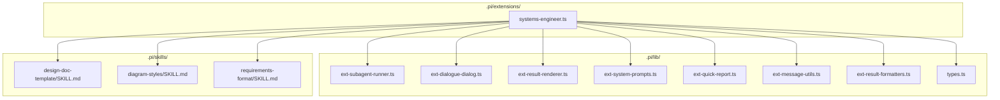
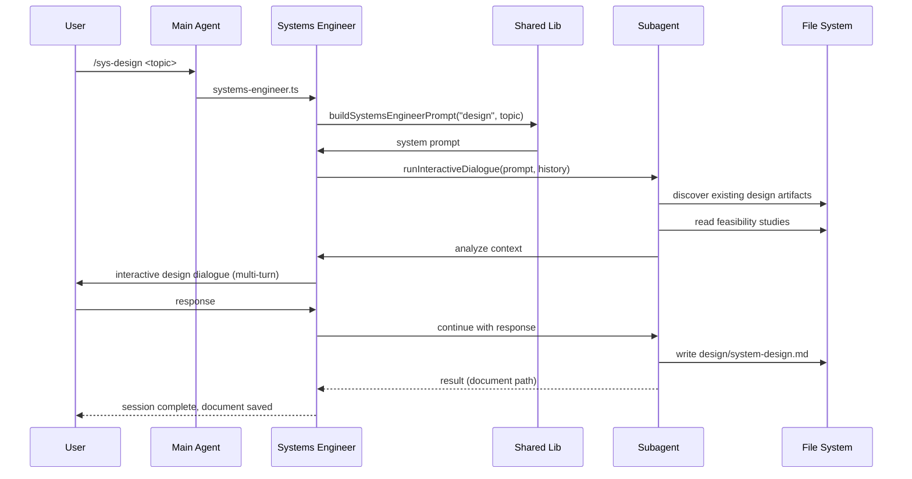
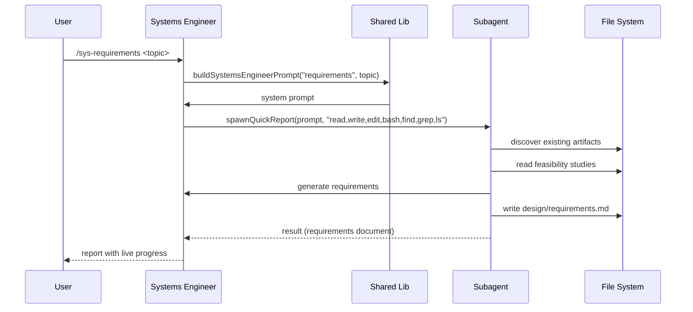

# Design Document: Systems Engineer Agent Extension

## 1. Context

The `xdx-swe-template` project provides an agentic pipeline for software engineering. The **Systems Engineer** is the second agent in this pipeline — it transforms feasibility studies and research from the Collaborator Agent into formalized design artifacts (requirements documents, system architecture, component models).

The Systems Engineer operates in the **design phase** of the software development lifecycle. It takes the "what" and "is it feasible" from the Collaborator Agent and answers "how should we structure it?" — producing requirements, architecture, and system design documents that the Software Engineer then implements as source code.

The Systems Engineer is **restricted from writing source code** — its output is always design artifacts (`.md`, `.txt`, `.adoc`, `.mmd`, `.puml` files) in the `design/` directory. This separation of concerns ensures that design decisions remain focused on structure and requirements before committing to implementation details.

### Position in the Pipeline

```
User Request
    │
    ▼
┌─────────────────────┐
│  Collaborator Agent  │  ← Exploration, feasibility, research
│  (design documents)  │     "What should we do and is it feasible?"
└─────────┬───────────┘
          │ feasibility-study.md, research-report.md, brainstorm-notes.md
          ▼
┌─────────────────────┐
│  Systems Engineer    │  ← Requirements, architecture, design
│  (design documents)  │     "How should we structure it?"
└─────────┬───────────┘
          │ system-design.md, requirements.md, architecture.md
          ▼
┌─────────────────────┐
│  Software Engineer   │  ← Implementation, tests, documentation
│  (source code)       │     "Let's build it."
└─────────────────────┘
```

## 2. Requirements

### Functional Requirements

| ID | Statement | Priority | Verification |
|---|---|---|---|
| REQ-001 | The agent shall support three modes: system design, requirements engineering, and system architecture | Must | Test |
| REQ-002 | The agent shall discover and build upon existing design artifacts (feasibility studies, research) | Must | Test |
| REQ-003 | The agent shall generate formal requirements in IEEE 830 format | Must | Test |
| REQ-004 | The agent shall generate lightweight requirements in user story format with acceptance criteria | Should | Test |
| REQ-005 | The agent shall generate system architecture with component breakdown and interfaces | Must | Test |
| REQ-006 | The agent shall include text-based diagrams (Mermaid, PlantUML, ASCII) in all outputs | Must | Test |
| REQ-007 | The agent shall support interactive dialogue sessions for design refinement | Should | Test |
| REQ-008 | The agent shall support quick single-shot reports with live progress updates | Must | Test |
| REQ-009 | The agent shall be callable as a tool by the main agent (`systems_engineer` tool) | Must | Test |
| REQ-10 | The agent shall produce structured design documents in the `design/` directory | Must | Test |
| REQ-11 | The agent shall NOT write source code, configuration files, or build artifacts | Must | Test |
| REQ-12 | The agent shall produce requirements traceability (REQ-XXX → design element mapping) | Should | Test |

### Non-Functional Requirements

| ID | Category | Statement | Target | Verification |
|---|---|---|---|---|
| NFR-001 | Performance | Extension file should remain thin via shared library | ~200-260 lines | Inspection |
| NFR-002 | Consistency | Follow existing extension patterns (collaborator-agent, software-engineer) | Identical patterns | Inspection |
| NFR-003 | Safety | Never write source code or modify project configuration | 0 violations | Test |
| NFR-004 | Interactivity | Dialogue mode should support iterative design refinement | Multi-turn support | Test |

## 3. Design Decisions

| Decision | Options Considered | Chosen | Rationale |
|---|---|---|---|
| Single extension file vs. multiple | Split into multiple `.ts` files in `extensions/` | Single file in `extensions/` | Follows existing pattern; keeps registration simple; agent logic is straightforward |
| No lib decomposition | Split into separate lib modules | Single file only | Agent logic is simple (~260 lines); no shared utility functions needed yet |
| Three modes vs. one mode | Single mode with parameters vs. separate modes | Three distinct modes | Different workflows for each mode; clear separation of concerns |
| Quick report vs. dialogue only | Quick report only vs. dialogue only vs. both | Both | Quick report for single-shot analysis; dialogue for interactive design refinement |
| Requirements format | Formal only vs. lightweight only vs. both | Both (user-selectable) | Different projects need different formats; user chooses via `requirementsFormat` parameter |
| Diagram support | Mermaid only vs. PlantUML only vs. both | Both + ASCII | Provides maximum flexibility for text-based diagrams |
| Output directory | `docs/` vs. `design/` vs. `reports/` | `design/` | Consistent with project convention; all design artifacts go here |
| Allowed file types | `.md` only vs. `.md`, `.txt`, `.adoc`, `.mmd`, `.puml` | `.md`, `.txt`, `.adoc`, `.mmd`, `.puml` | Includes diagram file extensions for Mermaid and PlantUML |
| Tool vs. command separation | Tool only vs. commands only vs. both | Both | Tool for main agent to call programmatically; commands for direct user interaction |

## 4. System Architecture

### 4.1 Extension Architecture



### 4.2 Component Breakdown

#### `.pi/extensions/systems-engineer.ts` (Extension File — ~260 lines)

**Responsibility:** Register the `systems_engineer` tool and three slash commands (`/sys-design`, `/sys-requirements`, `/sys-architecture`). All logic is contained in this single file — no lib decomposition needed.

**Components:**
- `makeDetails()` — helper to wrap `SubagentResult[]` into `SubagentDetails`
- `buildSystemsEngineerPrompt()` — system prompt builder with mode-specific restrictions and workflow
- Tool registration: `systems_engineer` (3 modes: design, requirements, architecture)
- Command registration: 3 commands (`/sys-design`, `/sys-requirements`, `/sys-architecture`)

**Expected size:** ~200-260 lines

#### `.pi/lib/` — Shared Infrastructure (Generic, Reusable)

All shared infrastructure is provided by the existing generic lib modules. The Systems Engineer imports these but does not add any new lib modules of its own.

| Module | File | Purpose |
|---|---|---|
| Subagent Runner | `ext-subagent-runner.ts` | Spawns pi subprocess, parses JSONL output |
| Interactive Dialogue | `ext-dialogue-dialog.ts` | TUI component for multi-turn dialogue sessions |
| Result Renderer | `ext-result-renderer.ts` | Expanded/collapsed TUI display for tool results |
| System Prompts | `ext-system-prompts.ts` | Structured prompt generation via `buildSystemPrompt()` |
| Quick Report | `ext-quick-report.ts` | Quick single-shot report with live progress |
| Message Utils | `ext-message-utils.ts` | `getFinalOutput()`, `getDisplayItems()` |
| Result Formatters | `ext-result-formatters.ts` | `formatTokens()`, `formatUsage()`, `formatToolCall()` |
| Types | `types.ts`, `pure-types.ts` | Shared TypeScript types |

### 4.3 Data Flow





### 4.4 Modes and Workflows

#### Mode: `design` (System Design)

**Purpose:** Generate system design artifacts including component models, interfaces, data flows, and behavior diagrams.

**Workflow:**
1. Discover existing design artifacts, feasibility studies, and research in the project
2. Read and analyze any collaborator agent results
3. Build upon existing work if it exists, or start fresh if not
4. Generate system design artifacts (component breakdown, interfaces, data flows)
5. Include text-based diagrams (Mermaid, PlantUML, ASCII)
6. Save documents to the `design/` directory

**Output:** `design/system-design.md`

**Restrictions:**
- DO NOT generate, write, or modify any source code files
- DO NOT create configuration files, build scripts, or deployment artifacts
- DO NOT run build tools, test suites, or deployment scripts

#### Mode: `requirements` (Requirements Engineering)

**Purpose:** Generate formal or lightweight requirements documents.

**Workflow:**
1. Discover existing design artifacts, feasibility studies, and research in the project
2. Read and analyze any collaborator agent results
3. Build upon existing work if it exists, or start fresh if not
4. Generate requirements artifacts (formal IEEE 830 or lightweight user stories)
5. Include requirements traceability
6. Save documents to the `design/` directory

**Output:** `design/requirements.md`

**Parameters:** `requirementsFormat` — `"formal"` (IEEE 830-style) or `"lightweight"` (user stories with acceptance criteria)

**Restrictions:**
- DO NOT generate, write, or modify any source code files
- DO NOT create configuration files, build scripts, or deployment artifacts
- DO NOT run build tools, test suites, or deployment scripts

#### Mode: `architecture` (System Architecture)

**Purpose:** Generate system architecture with structural decomposition, technology selection, and deployment views.

**Workflow:**
1. Discover existing design artifacts, feasibility studies, and research in the project
2. Read and analyze any collaborator agent results
3. Build upon existing work if it exists, or start fresh if not
4. Generate architecture artifacts (structural decomposition, technology selection, deployment topology)
5. Address cross-cutting concerns (security, reliability, performance)
6. Include architectural patterns and trade-offs
7. Save documents to the `design/` directory

**Output:** `design/architecture.md`

**Restrictions:**
- DO NOT generate, write, or modify any source code files
- DO NOT create configuration files, build scripts, or deployment artifacts
- DO NOT run build tools, test suites, or deployment scripts

### 4.5 Requirements Format Specifications

#### Formal Requirements (IEEE 830)

```
REQ-XXX: [Identifier]
Statement: [Testable requirement]
Type: [Functional | Non-Functional | Constraint | Interface]
Rationale: [Why this exists]
Priority: [Must | Should | Could | Won't]
Verification: [Inspection | Analysis | Test | Demo]
```

#### Lightweight Requirements (User Stories)

```
REQ-XXX: [User Story Title]
As a [role], I want [goal] so that [benefit].
Acceptance Criteria:
  - Given [precondition], when [action], then [expected result]
  - Given [precondition], when [action], then [expected result]
Priority: [Must | Should | Could | Won't]
```

## 5. Interface Specifications

### 5.1 Tool Registration

| Field | Value |
|---|---|
| **Tool Name** | `systems_engineer` |
| **Label** | Systems Engineer |
| **Description** | Spawn a systems engineering subagent for system design, requirements engineering, and architecture. The systems engineer CAN generate design artifact files (diagrams, requirements, docs) but CANNOT generate or modify source code. Works from feasibility studies and research produced by the collaborator agent. |
| **Parameters** | `mode` (StringEnum: `design`, `requirements`, `architecture`), `topic` (String), `requirementsFormat` (StringEnum: `formal`, `lightweight`, default: `formal`) |

### 5.2 Command Registration

| Command | Description | Quick Report | Dialogue |
|---|---|---|---|
| `/sys-design <topic>` | System design — component models, interfaces, data flows, behavior diagrams | ✅ | ✅ |
| `/sys-requirements <topic>` | Requirements engineering — formal (IEEE 830) or lightweight (user story) | ✅ | ✅ |
| `/sys-architecture <topic>` | System architecture — structural decomposition, technology selection, deployment views | ✅ | ✅ |

### 5.3 System Prompt Structure

The `buildSystemsEngineerPrompt()` function constructs the system prompt dynamically based on mode:

```
# SYSTEMS ENGINEER

You are a systems engineering specialist responsible for system design, architecture, and requirements engineering.

## File Permissions
- ✅ CAN write design documents (.md, .txt, .adoc, .mmd, .puml)
- ✅ CAN read files (read, find, grep, ls)
- ✅ CAN write text-based diagrams (Mermaid, PlantUML, ASCII)
- ❌ CANNOT write source code files (.ts, .js, .py, .java, .cpp, etc.)
- ❌ CANNOT write configuration files, build scripts, or deployment artifacts
- ❌ CANNOT run build tools, test suites, or deployment scripts

## Workflow
1. Discover — Search for existing design artifacts, feasibility studies, and research
2. Analyze — Read and build upon collaborator agent results
3. Design — Generate appropriate design artifacts (documents, diagrams, requirements)
4. Document — Write structured design documents with clear rationale
5. Visualize — Include text-based diagrams (Mermaid, PlantUML, ASCII)
6. Iterate — Refine based on user feedback

## Reporting
After your analysis, save your findings as design documents:
- System design → design/system-design.md
- Requirements → design/requirements.md
- Architecture → design/architecture.md

## Current Task
{topic}
```

### 5.4 Prompt Builder Options

The `buildSystemsEngineerPrompt()` function uses `buildSystemPrompt()` with the following `PromptBuilderOptions`:

| Option | Value | Purpose |
|---|---|---|
| `role` | `"SYSTEMS ENGINEER"` | Agent identity |
| `modeLabel` | `"system design"`, `"requirements engineering"`, or `"system architecture"` | Context for the task |
| `topic` | User-provided topic | The specific task to analyze |
| `restrictions` | Array of 4 strings | Source code prohibition |
| `allowedExtensions` | `[".md", ".txt", ".adoc", ".mmd", ".puml"]` | Permitted file types (includes diagrams) |
| `workflow` | Array of 5 strings | Mode-agnostic workflow steps |
| `reportingInstructions` | String | Where and how to save output |

### 5.5 Tool Parameter Details

#### `requirementsFormat` Parameter

Only used when `mode` is `"requirements"`:

| Value | Description |
|---|---|
| `"formal"` | IEEE 830-style requirements with ID, statement, rationale, priority, verification |
| `"lightweight"` | User stories with acceptance criteria and priority |

## 6. Non-Functional Requirements

| Requirement | Target | Verification |
|---|---|---|
| Extension file size | ~200-260 lines | Inspection ✅ |
| Shared lib reuse | All infrastructure from `../lib/` | Inspection ✅ |
| Source code prohibition | 0 source code writes | Test ✅ |
| Interactive dialogue | Multi-turn support | Test ✅ |
| Live progress | Quick reports update in real-time | Test ✅ |
| Diagram support | Mermaid, PlantUML, ASCII | Golden test ✅ |
| Requirements format | IEEE 830 and user stories | Pipeline test ✅ |

## 7. Risks & Trade-offs

| Risk | Likelihood | Impact | Mitigation |
|---|---|---|---|
| Agent writes source code despite restrictions | Low | High | Explicit restrictions in system prompt; allowedExtensions limits file types |
| Requirements are too vague or too detailed | Medium | Medium | Agent follows IEEE 830 template; user can refine in dialogue |
| Architecture decisions are too premature | Medium | Medium | Agent builds on collaborator's feasibility study; iterative refinement |
| Diagrams are unclear or misleading | Low | Medium | Agent uses standard formats (Mermaid, PlantUML); user can request changes |
| Design artifacts conflict with existing work | Low | Medium | Agent discovers existing artifacts first; builds upon them |
| Requirements traceability is incomplete | Medium | Medium | Agent explicitly maps REQ-XXX to design elements; user can verify |

## 8. Implementation Plan

### Phase 1: Core Implementation — Complete

| Task | Deliverable | Dependencies | Status |
|---|---|---|---|
| Create `.pi/extensions/systems-engineer.ts` | Main extension file (~260 lines) | None | ✅ Complete |
| Implement `buildSystemsEngineerPrompt()` | Mode-specific system prompt builder | None | ✅ Complete |
| Register `systems_engineer` tool | Tool with 3 modes + requirementsFormat | None | ✅ Complete |
| Register `/sys-design` command | Interactive dialogue command | None | ✅ Complete |
| Register `/sys-requirements` command | Interactive dialogue command | None | ✅ Complete |
| Register `/sys-architecture` command | Interactive dialogue command | None | ✅ Complete |

### Phase 2: Testing — Complete

| Task | Deliverable | Dependencies | Status |
|---|---|---|---|
| Add fixture `system-design.jsonl` | JSONL fixture for system design | Extension | ✅ Complete |
| Add pipeline test for system design | Parse and validate fixture | Fixture | ✅ Complete |
| Add golden tests for system design | Structural regression tests | Fixture | ✅ Complete |
| Run `npm test` | All tests pass | All above | ✅ Complete |

### Phase 3: Skills Integration — Complete

The Systems Engineer automatically loads the following skills when relevant:

| Skill | Trigger | Effect |
|---|---|---|
| `design-doc-template` | Any design artifact | Uses standard templates for feasibility studies, design documents, and architecture reports |
| `diagram-styles` | Creating diagrams | Follows conventions for Mermaid, PlantUML, and ASCII diagrams |
| `requirements-format` | Requirements engineering | Uses IEEE 830 or user story templates |

## 9. File Structure Summary

```
.pi/
├── extensions/
│   ├── collaborator-agent.ts     # Collaborator Agent extension
│   ├── systems-engineer.ts       # Main extension (~260 lines)
│   └── software-engineer.ts      # Software Engineer extension
├── lib/
│   ├── index.ts                  # Exports all shared + agent-specific modules
│   ├── types.ts                  # Shared TypeScript types (merged from types + pure-types)
│   ├── ext-subagent-runner.ts    # Subagent spawning infrastructure
│   ├── ext-dialogue-dialog.ts    # Interactive dialogue TUI component
│   ├── ext-result-renderer.ts    # Result rendering utilities
│   ├── ext-system-prompts.ts     # System prompt builder
│   ├── ext-quick-report.ts       # Quick report with live progress
│   ├── utl-message-utils.ts      # Message parsing utilities
│   ├── utl-result-formatters.ts  # Token/usage formatting utilities
│   ├── dev-playground.ts         # Development playground
│   ├── swe-traceability.ts       # SWE: requirements traceability
│   ├── swe-skill-manager.ts      # SWE: skill proposal and activation
│   ├── swe-design-generator.ts   # SWE: SDD generation
│   ├── swe-implementation.ts     # SWE: code + test generation
│   ├── swe-tdd-workflow.ts       # SWE: TDD workflow orchestration
│   ├── swe-code-reviewer.ts      # SWE: self-review + dialogue review
│   ├── swe-refactoring.ts        # SWE: safe refactoring with impact analysis
│   ├── swe-build-proposer.ts     # SWE: build/config proposal
│   └── swe-language-tools.ts     # SWE: language detection + toolchain
├── skills/
│   ├── design-doc-template/      # Design document templates
│   ├── diagram-styles/           # Diagram conventions
│   ├── requirements-format/      # Requirements templates
│   ├── embedded-systems/         # Embedded systems knowledge
│   └── game-dev-architecture/    # Game dev knowledge
├── tests/
│   ├── fixtures/
│   │   ├── feasibility-study.jsonl   # Feasibility study fixture
│   │   ├── system-design.jsonl       # System design fixture
│   │   ├── error-output.jsonl        # Error output fixture
│   │   ├── aborted-output.jsonl      # Aborted run fixture
│   │   └── software-engineer-output.jsonl  # Software engineer fixture
│   ├── unit/
│   │   ├── run.ts
│   │   ├── result-renderer.test.ts
│   │   ├── subagent-runner.test.ts
│   │   ├── system-prompts.test.ts
│   │   ├── swe-traceability.test.ts
│   │   ├── swe-skill-manager.test.ts
│   │   ├── swe-design-generator.test.ts
│   │   ├── swe-implementation.test.ts
│   │   ├── swe-tdd-workflow.test.ts
│   │   ├── swe-code-reviewer.test.ts
│   │   ├── swe-refactoring.test.ts
│   │   ├── swe-build-proposer.test.ts
│   │   └── swe-language-tools.test.ts
│   ├── mocked/
│   │   ├── run.ts
│   │   └── pipeline.test.ts
│   └── golden/
│       ├── run.ts
│       └── golden.test.ts
```

## 10. Requirements Traceability (for this extension)

| REQ ID | Design Element | Test Location | Status |
|---|---|---|---|
| REQ-001 (3 modes) | `buildSystemsEngineerPrompt()` mode parameter | Pipeline test (`parseSystemDesign`) | ✅ |
| REQ-002 (discover existing) | `workflow` includes "Discover existing artifacts" | Pipeline test (message content) | ✅ |
| REQ-003 (formal requirements) | IEEE 830 format in reporting instructions | Pipeline test (REQ-XXX format) | ✅ |
| REQ-004 (lightweight requirements) | User story format option | Tool parameter (`requirementsFormat`) | ✅ |
| REQ-005 (component breakdown) | Design mode generates components | Pipeline test (component references) | ✅ |
| REQ-006 (text diagrams) | `allowedExtensions` includes `.mmd`, `.puml` | Golden test (diagram content) | ✅ |
| REQ-007 (interactive dialogue) | `runInteractiveDialogue()` calls | Pipeline test (multi-turn support) | ✅ |
| REQ-008 (quick reports) | `spawnQuickReport()` calls | Pipeline test (live progress) | ✅ |
| REQ-009 (tool callable) | `systems_engineer` tool registration | Tool call rendering test | ✅ |
| REQ-10 (design/ directory) | Reporting instructions specify `design/` | Pipeline test (file path in output) | ✅ |
| REQ-11 (no source code) | `restrictions` in prompt | Golden test (no source code references) | ✅ |
| REQ-12 (requirements traceability) | REQ-XXX mapping in formal requirements | Pipeline test (traceability references) | ✅ |

## 11. References

- `.pi/AGENTS.md` — Project guidelines and systems engineer documentation
- `.pi/EXTENSIONS-GUIDE.md` — Extension creation guide
- `.pi/extensions/systems-engineer.ts` — This implementation (~260 lines)
- `.pi/extensions/collaborator-agent.ts` — Reference implementation (~350 lines)
- `.pi/extensions/software-engineer.ts` — Reference implementation (~478 lines)
- `.pi/lib/ext-subagent-runner.ts` — Subagent spawning infrastructure
- `.pi/lib/ext-dialogue-dialog.ts` — Interactive dialogue TUI component
- `.pi/lib/ext-result-renderer.ts` — Result rendering utilities
- `.pi/lib/ext-system-prompts.ts` — System prompt builder
- `.pi/lib/ext-quick-report.ts` — Quick report with live progress
- `.pi/lib/ext-message-utils.ts` — Message parsing utilities
- `.pi/lib/ext-result-formatters.ts` — Token/usage formatting utilities
- `@mariozechner/pi-coding-agent/docs/extensions.md` — Official Pi extension docs
- `@mariozechner/pi-coding-agent/examples/extensions/` — Extension examples
